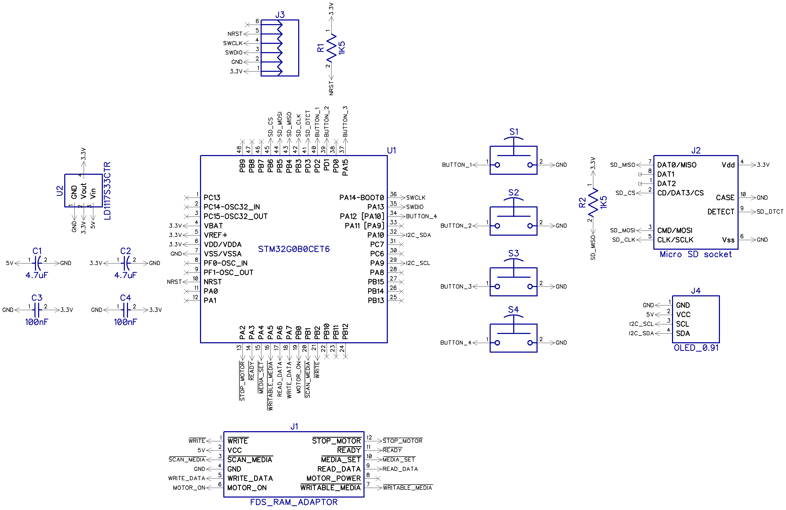
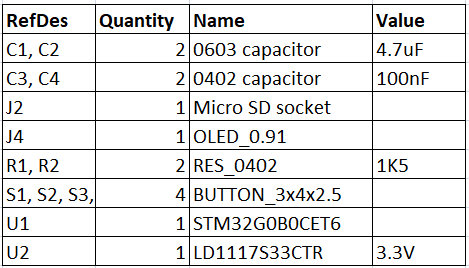

# FDSKey
An open-source, low-cost, and easy-to-build Famicom Disk System drive emulator featuring a sleek OLED display.


How you can use it:
* You can run Famicom Disk System disk images from a microSD card 
* You can dump disks using a physical FDS drive without additional hardware/cables
* You can write disks using a physical FDS drive without additional hardware/cables

Requirements:
* Famicom
* Famicom Disk System RAM adaptor
* microSD card

## How to build it
You'll need a few low-cost components.

### Circuit diagram


### Bill of materials


### Components
1. **PCB**


The PCB is designed in the [DipTrace](https://diptrace.com/) software.

You can have it produced at any PCB factory (e.g. [jlcpcb.com](https://jlcpcb.com) or [PCBWay](https://pcbway.com/)) using [gerber files](PCB_gerbers). PCB properties:
* PCB thickness: 1.6mm
* Gold fingers are recommended

2. **STM32G0B0CET (or any STM32G0B0CETxxx) microcontroller**


You can easily find it on [mouser.com](https://www.mouser.com/c/?q=STM32G0B0CET) or [taobao.com](https://s.taobao.com/search?q=STM32G0B0CET).

3. **OLED display module**


It's a very popular OLED display, search for **SSD1306 0.91-inch OLED 128x32 4-pin** on [aliexpress.com](https://aliexpress.com), [ebay.com](https://ebay.com), [amazon.com](https://amazon.com) or [taobao.com](https://taobao.com). These displays are available in different colors: blue, white and yellow, you can select the one you prefer.

Solder it like this:


It's recommended to put something soft under the display on the right side.

**WARNING**: some unscrupulous sellers may sell you used, burned-in displays.

4. **microSD card socket (push-push, 8-pin + card detect pin = 9-pin)**


It's a very popular push-push socket, they can be found on [aliexpress.com](https://aliexpdress.com). Also, you can search for **112J-TDAR-R01** model but there are many compatible models with other names. You can always modify the PCB to accommodate a different socket model.

5. **LD1117S33 stabilizer**


You can buy it in any electronic components store.

6. **Four SMD buttons**


Search for **3X4X2.5H SMD** buttons, they can be found on [aliexpress.com](https://aliexpress.com), [ebay.com](https://ebay.com), [amazon.com](https://amazon.com) or [taobao.com](https://taobao.com). You can also search for **434133025816** model on [mouser.com](https://www.mouser.com/c/?q=STM32G0B0CET).

7. **Resistors and capacitors**


You will need only a few of them:
* C1, C2 - two 4.7uF ceramic capacitors, 0603 size (higher values are not recommended)
* C3, C4 - two 100nF ceramic capacitors, 0402 size (0603 will be fine too)
* R1, R2 - two 1.5K resistors, 0402 size (0603 will be fine too), actually you can also use any values from 1K to 10K

You can buy them in any electronic components store.

8. **Plastic case**


You can print plastic case with a 3D printer. You can find .stl files in the [case_3d_models](case_3d_models) directory. There are two types of models:
* [For FDM 3D printers](case_3d_models/fdm) - can be printed on a affordable home 3D printer, the bottom and top parts of the case must be glued together
* [For MJF 3D printers](case_3d_models/mjf) (recommended) - for industrial 3D printing, you can order it from a manufacturing service (e.g. [jlcpcb.com](https://jlcpcb.com)), this version features latches


What does it look like when everything is assembled:


## Flashing the firmware
There are five TH pads (actually 6 but 1 is unused) on the PCB to connect a ST-Link (or clone) programmer: GND, VCC, SWD, SWCLK, and NRST. Use [**STM32CubeProg**](https://www.st.com/en/development-tools/stm32cubeprog.html) software (Win/Linux/Mac) to write the bootloader and the firmware. Old **STM32 ST-LINK Utility** will not work, it's deprecated.

First, you need to write the bootloader - **bootloader.bin** file. Use a programmer and write it to the **0x08000000** address (start of the flash memory, default address).

Then you can put the main firmware file - **FdsKey.bin** on your SD card (FAT/FAT32/exFAT formatted) and hold all four buttons on power-on, e.g. connect FDSKey to RAM adaptor, hold buttons and turn a Famicom on. You can use the same method to update the main firmware in the future without additional hardware. You can also use a programmer and write it to the **0x08020000** address.

You can write the bootloader and the firmware at once using the STM32CubeProg CLI tool:

`STM32_Programmer_CLI.exe -c port=SWD --erase all --download bootloader.bin 0x08000000 --download fdskey.bin 0x08020000`

After the first boot, press and hold the **left** button on the main menu screen for 3 seconds to access the service menu. There, you can select the OLED display controller type (change it if the display shows a corrupted image in "lefty mode") and check some system information.

## Device usage
Format a microSD card to FAT/FAT32/exFAT and put some .fds files on it. Insert a microSD card into a FDSKey, insert a FDSKey into a RAM Adaptor's cable instead of a physical disk drive and turn on a Famicom. You can hot plug a FDSKey when Famicom is already on too, it's ok.

Now you can navigate through the FDSKey interface using the buttons. **Left** button usually means **back**, **right** button usually means **OK** and **up**/**down** are used to select something (file, disk side, etc.) Also, you can long press the **left** button in the file browser to directly return to the main menu from a subfolder, and long press the **right** button to open the file properties menu.


Oops, too complicated :( Let's try again...


Much better.

**WARNING**: when a game writes some data to a virtual disk (i.e., saves game progress) don't turn off your Famicom power until the updated ROM has been saved to the SD card. Wait a second for it or eject a virtual disk (**left** button). A **saving** message will be displayed, do not turn off power while this message is visible.

### Settings menu
Use **up**/**down** buttons to select a setting and **left**/**right** to change it. Setting descriptions:
* **Rewind speed**: you can select a drive operation speed as either **original** (very slow, like on a physical FDS drive, for the nostalgic ones), **fast** (where the rewind time is reduced but the virtual head position is not altered), or **turbo** (the fastest possible mode, instant head rewind).
* **Remember state**: you can select a power-on state between **none** (always start from the main menu), **browser** (open browser and select last file if browser was opened before power off), and **ROM** (start first side of the last started game emulation if ROM emulation was active before power off).
* **Saves** (since v1.1): you can select how to save game progress as either **overwrite** (just overwrite the original .fds file), **backup+overwrite** (just overwrite the original .fds file but make backup to .fds.bak file first), or **like EverDrive** (EverDrive-compatible saves format).
* **Hide non .fds files**: hide files with non .fds extension in the file browser.
* **Hide .fds extensions**: hide .fds extension in the file browser.
* **Hide hidden files**: hide hidden files and directories in the file browser.
* **Brightness**: screen brightness from 0 to 10.
* **Invert screen**: draw black on white instead of white on black.
* **Lefty mode**: rotate screen image on 180 degrees and flip buttons.
* **Screen off after**: time before automatic screen off if there is no any action (button presses, drive activity), it's recommended to use this feature to prevent OLED screen burn-in.
* **[ Save and return ]**: press **left** or **right** button on this item to return to the main menu.

### Service menu ###
You can access the service menu by holding the **left** button on the main menu screen for 3 seconds. This menu is mainly meant for developers or advanced users. There is a lot of system information and several options/functions:
* **OLED controller**: try to change it in case if "lefty mode" is not working correctly.
* **[ Format SD card ]**: use it if you want to make low-level format of your SD card. Use it with caution as you will lose all your data! Make sure to backup your data first.
* **[ Update bootloader ]**: update bootloader firmware. You need to put both **bootloader.bin** and **bootloader.bin.md5** files in the root of your SD card. Use it with caution! In case of failure (power loss during update) you will brick the device.
* **[ Save and return ]**: press **left** or **right** button on this item to return to the main menu.

### How to dump physical disks
You can use a homebrew disk copier applications to copy a physical disk to a virtual one, simply create an empty ROM. There is **Create blank disk** item in the main menu for it.
1. Put **Disk Hacker**/**Disk Keeper** or another homebrew disk copier ROM on the SD card.
2. Select a disk copier software on your SD card like any other ROM and load it.
3. Return to the main menu and select **Create blank disk**.
4. Enter filename for the new ROM, trailing spaces will be trimmed.
5. When disk copier asks to insert game disk disconnect a FDSKey from a RAM adaptor and connect a physical FDS drive with a game disk inserted.
6. When disk copier asks to insert new/blank disk disconnect a physical drive, connect a FDSKey and select ROM created in steps 3-4.
7. Repeat steps 5-6 until the copy operation is completed.

### How to write physical disks
This is a reverse operation of dumping: you can use disk copiers homebrew applications to copy a virtual disk to a physical one. Please note that **you need to remove the copy protection on your physical drive** if it has any. In most cases, it's not such a difficult process.
1. Put **Disk Hacker**/**Disk Keeper** or another homebrew disk copier ROM on the SD card.
2. Select a disk copier software on your SD card like any other ROM and load it.
3. When disk copier asks to insert game disk select the source ROM/side.
4. When disk copier asks to insert new/blank disk disconnect a FDSKey from a RAM adaptor and connect a physical FDS drive with blank disk inserted.
5. Disconnect a physical FDS drive and connect FDSKey.
6. Repeat steps 3, 4, and 5 until the copy operation is completed.

## Firmware updates
You can always download the latest version at https://github.com/ClusterM/fdskey/releases.

Also, you can download automatic interim builds at http://clusterm.github.io/fdskey/.

Remember, you can update the firmware by putting **FdsKey.bin** on your SD card and holding all four buttons on power-on.


## Twin Famicom compatibility
You can use FDSKey with Twin Famicom too. But you need a special cable. It's easy to make one.


It has a simple 12x1 dupont connector on the one side, you need to connect it to Twin Famicom's **Port C** on the back-bottom side (instead of the original cable).

Unfortunately, there is a non-standard connector on the other side of the cable. But you can use a SFC/SNES/N64/NGC AV connector:


You can find it on [aliexpress.com](https://aliexpress.com). But you need to cut a "key" - piece of plastic on this connector, or just use the FDSKey without a case.

Connection diagram:
```
           Twin Famicom Port C                   Connector for FDSKey
       (looking at rear of console)          (looking from FDSKey's side)
█████████████████████████████████████████  ████████████████████████████████
█████████████████████████████████████████  ████████████████████████████████
██                                     ██  ███  1   3   5   7   9   11  ███
██ 8  6  2  4  1  3  5  7  9  11 12 10 ██  ███  2   4   6   8   10  12  ███
█████████████████████████████████████████  \██████████████████████████████/
█████████████████████████████████████████   \████████████████████████████/

Pin meanings
+----+---+-----------------------+
| 1  | O | /write                |
| 2  | O | VCC (+5VDC)           |
| 3  | O | /scan media           |
| 4  | O | VEE (ground)          |
| 5  | O | Write data            |
| 6  | I | Motor on/battery good |
| 7  | I | /writable media       |
| 8  | - | ---                   |
| 9  | I | Read data             |
| 10 | I | /media set            |
| 11 | I | /ready                |
| 12 | O | /stop motor           |
+----+---------------------------+
```
It's recommended to pull-up at least **/scan media** pin to **VCC** via resistor (5K-10K) if you want to hot plug the FDSKey, because Twin Famicom has no pull-up resistors inside it. Also, don't forget to upgrade the FDSKey firmware to at least **v1.3**.


## Donate
* [Buy Me A Coffee](https://www.buymeacoffee.com/cluster)
* [Donation Alerts](https://www.donationalerts.com/r/clustermeerkat)
* [Boosty](https://boosty.to/cluster)
* BTC: 1MBYsGczwCypXhMBocoDQWxx7KZT2iiwzJ
* PayPal is not available in Armenia :(
