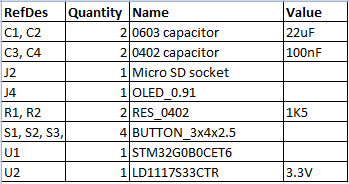

# FDSKey
Open source, cheap and easy-to-build Famicom Disk System drive emulator with a nice OLED display.

Work in progress. It's not finished yet.

TODO: add more photos
TODO: fix my bad engrish

How you can use it:
* Run disk images for a Famicom Disk System from a Micro SD card 
* Dump disks using a real FDS drive without additional hardware/cables
* Write disks using a real FDS drive without additional hardware/cables

Requirements:
* Famicom
* Famicom Disk System RAM adaptor
* Micro SD card

## How to build it
You'll need a few cheap components.

### Сircuit diagram

### Bill of materials

### Components
1. **PCB**

TODO: add PCB photo

The PCB is designed in the [DipTrace](https://diptrace.com/) software.

You can order it from any PCB factory (e.g. [jlcpcb.com](jlcpcb.com)) using [gerber files](PCB_gerbers). PCB properties:
* PCB thickness: 1.6mm
* Gold fingers are recommended

2. **STM32G0B0CET (or any STM32G0B0CETxxx) microcontroller**

You can easily find it on [mouser.com](https://www.mouser.com/c/?q=STM32G0B0CET) or [taobao.com](https://s.taobao.com/search?q=STM32G0B0CET).

3. **OLED display module**

It's a very popular OLED display, search for **SSD1306 0.91 inch OLED 128x32 4-pin** on [aliexpress.com](aliexpress.com), [ebay.com](ebay.com), [amazon.com](amazon.com) or [taobao.com](taobao.com). Those displays are available in different colors: blue, white and yellow, you can select which you like more.

**WARNING**: some unscrupulous sellers can sell you used burned-in display.

4. **Micro SD card socket (push-push, 8-pin + card detect pin = 9-pin)**

It's a very popular push-push socket, you can find it on [aliexpress.com](aliexpdress.com). Also, you can search for **112J-TDAR-R01** model but there are many compatible models with other names. You can always edit the PCB for another socket model.

5. **LD1117S33 stabilizer**

You can buy it in any electronic components store.

6. **Four SMD buttons**

Search for **3X4X2.5H SMD** buttons, you can find them on [aliexpress.com](aliexpress.com), [ebay.com](ebay.com), [amazon.com](amazon.com) or [taobao.com](taobao.com). You can also search for **434133025816** model on [mouser.com](https://www.mouser.com/c/?q=STM32G0B0CET).

7. **Resistors and capacitors**

There are very few of them:
* C1, C2 - two 22uF ceramic capacitors, 0603 size
* C3, C4 - two 100nF ceramic capacitors, 0402 size (0603 will be fine too)
* R1, R2 - two 1.5K resistors, 0402 size (0603 will be fine too), actually you can also use any values from 1K to 10K

You can buy them in any electronic components store.

8. **Plastic case**

Work in progress.

## Flashing the firmwire
There are five pins (6 but 1 is unused) on the PCB to connect a ST-Link programmer (GND, VCC, SWD, SWCLK and NRST). First, you need to write the bootloader - **bootloader.bin** file. Then you can put the main firmware file - **fdskey.bin** on your SD card (FAT/FAT32/exFAT formatted) and hold all four buttons on power-on, e.g. connect FDSKey to RAM adaptor, hold buttons and turn a Famicom on. You can use the same method to update the main firmware in the future without additional hardware.

After first boot you can hold **left** button for 3 seconds to enter the service menu. You can select OLED display controller type (change it if display shows corrupted image) there and check some system info.

## Device usage
Format a micro SD cart to FAT/FAT32/exFAT and put some .fds files on it. Insert a micro SD cart into a FDSKey, insert a FDSKey into a RAM Adaptor's cable instead of a real disk drive and turn on a Famicom. You can hotplug a FDSKey when Famicom is already on too, it's ok.

Now you can navitate through the FDSKey interface using buttons. **Left** button usually means **back**, **right** button usually means **OK** and **up**/**down** are used to select something (file, disk side, etc.) Also, you can use **left** button longpress in the file browser to return directly to the main menu from subfolder and **right** button longpress to open the file properties menu.

TODO: add some GUI images

**WARNING**: when a game writes some data on a virtual disk (saves game progress) don't turn off your Famicom power until a updated ROM saved to a SD card. Wait a few seconds for it or eject a virtual disk (**left** button). The **saving** message will be displayd. You can set an autosave delay in the settings menu (see below).

### Settings menu
Use **up**/**down** buttons to select a setting and **left**/**right** to change it. Setting descriptions:
* Rewind speed: you can select a drive operation speed between **original** (very slow, like on real FDS drive, for nostalgia guys), **fast** (rewind time reduced but virtual head position is not altered) and **turbo** (fastest possible mode)
* Remember state: you can select a power-on state between **none** (always start from the main menu), **browser** (open browser and select last file if broser was opened before power off) and **ROM** (start first side of the last started game emulation if ROM emulation was active before power off)
* Hide non .fds files: hide files with non .fds extension in the file browser
* Hide .fds extensions: hide .fds extension in the file browser
* Hide hidden files: hide hidden files and directories in the file browser
* Autosave delay: time between last drive activity and ROM file writing (if disk content was rewritten), 1 second is recommended
* Brightness: screen brightness from 0 to 10
* Invert screen: draw black on white instead of white on black
* Lefty mode: rotate screen image on 180 degrees and flip buttons
* Screen off after: time before automatic screen off if there is no any action (button presses, drive activity), recommended to use it to prevent OLED screen burn-in
* Backup original ROM: copy a .fds file to a .fds.bak file if a disk content was rewritten
* [ Save and return ] - press **left** or **right** on this item to return to the main menu

### How to dump a real disks
You can use a disk copiers homebrew applications to copy a real disk to a virtual one, just create a empty ROM. There is **Create blank disk** item in the main menu for it.
1. Put **Disk Hacker**/**Disk Keeper** or another homebrew disk copier ROM on SD card
2. Select a disk copier software on your SD card like any other ROM and load it
3. Return to the main menu and select **Create blank disk**
4. Enter filename for the new ROM, trailing spaces will be trimmed
5. When disk copier asks to insert game disk disconnect a FDSKey from a RAM adaptor and connect a real FDS drive with a game disk inserted
6. When disk copier asks to insert new/blank disk disconnect a real drive, connect a FDSKey and select ROM created in steps 3-4
7. Repeat steps 5-6 until copy operation is complited

### How to write a real disks
It's a reverse operation of dumping: you can use disk copiers homebrew applications to copy a virtual disk to a real one.
1. Put **Disk Hacker**/**Disk Keeper** or another homebrew disk copier ROM on SD card
2. Select a disk copier software on your SD card like any other ROM and load it
3. When disk copier asks to insert game disk select the source ROM/side
4. When disk copier asks to insert new/blank disk disconnect a FDSKey from a RAM adaptor and connect a real FDS drive with blank disk inserted
5. Disconnect a real FDS drive and connect FDSKey
6. Repeat steps 3-4-5 until copy operation is complited
